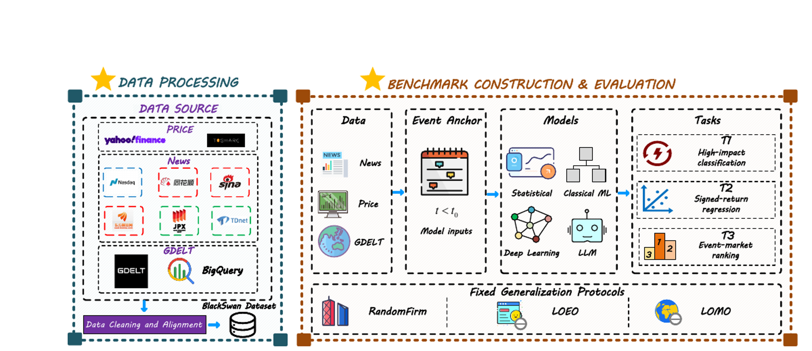
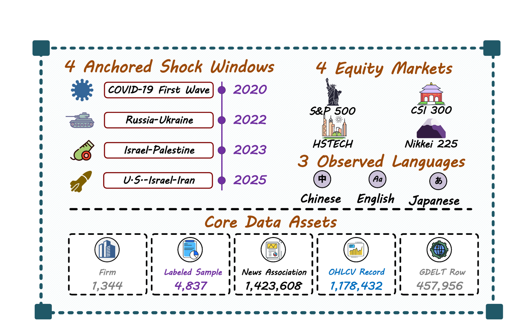

<div align="center">

# BlackSwanNewsBench

**A leakage-safe, multimodal benchmark for pre-event company impact prediction under rare shocks**


[Overview](#overview) | [Quick Start](#quick-start) | [Tasks](#benchmark-tasks) | [Data](#dataset) | [Add a Model](#evaluate-your-model) | [Documentation](#documentation)

</div>

<a id="overview"></a>
## 🔥 Overview

BlackSwanNewsBench evaluates whether models can use information available **strictly before an event anchor** to predict company-level impact over a future shock window. Each sample is an `(event_id, market, ticker)` tuple with aligned price, source-linked news, BGE-M3 news representations, and firm- and market-level GDELT context.

The benchmark separates held-out firms, events, and markets through fixed RandomFirm, Leave-One-Event-Out (LOEO), and Leave-One-Market-Out (LOMO) protocols.

<p align="center">
  <a href="assets/kdd-bench.pdf">
    
  </a>
  <br>
  <sub>Benchmark pipeline. Click the figure to open the vector PDF.</sub>
</p>

## 📊 At a Glance

| Scope | Value |
|---|---:|
| Anchored shock windows | 4 |
| Equity markets | 4 |
| Event-market settings | 16 |
| Observed firms | 1,344 |
| Candidate event-company samples | 5,046 |
| Samples with valid event-window labels | 4,837 |
| Source-news languages | Chinese, English, Japanese |

<p align="center">
  <a href="assets/datastatic.pdf">
    
  </a>
  <br>
  <sub>Dataset scope and core data assets. Click the figure to open the vector PDF.</sub>
</p>

<a id="benchmark-tasks"></a>
## 🎯 Benchmark Tasks

| Task | Objective | Metrics |
|---|---|---|
| **T1: High-impact classification** | Identify firms with unusually large absolute impact | AUPRC, AUROC |
| **T2: Signed-return regression** | Predict the signed event-window abnormal return | MAE, Spearman |
| **T3: Event-market ranking** | Rank firms by impact magnitude within each event-market group | NDCG@10%, Spearman |

T1 defines high impact as `abs(abnormal_return) >= Q90_train`, where the threshold is the 90th percentile of the **training split's** absolute abnormal returns. T3 is not an independent prediction head: `T3 score = abs(T2 prediction)`, evaluated within `event_id + market` groups.

### 🧭 Generalization Protocols

| Protocol | Held-out unit | Purpose |
|---|---|---|
| **RandomFirm** | Firms, stratified by market; official seed 42 | Unseen-firm generalization |
| **LOEO** | One event per fold | Cross-event generalization |
| **LOMO** | One market per fold | Cross-market generalization |

All protocols use frozen split files. Inputs are strictly pre-event, abnormal returns are reconstructed inside each split partition, and validation or test labels are never used to fit the T1 threshold.

<a id="dataset"></a>
## 🗃️ Dataset

The release provides both source-oriented modality tables and ready-to-run model inputs.

| Collection | Statistical unit | Rows |
|---|---|---:|
| `price` | market-firm-trading-day | 1,178,432 |
| `news` | event-market-firm-news association | 1,423,608 |
| `gdelt_firm` | event-market-firm-day | 457,956 |
| `gdelt_market` | event-market-day | 1,452 |
| `daily_features` | pre-event event-market-firm-day | 457,956 |
| `text_embeddings` | available-news event-market-firm-day | 112,916 |
| `outcomes` | candidate event-market-firm | 5,046 |

Counts refer to heterogeneous statistical units and should not be summed. In particular, `news` contains company-news **association rows**, not a count of unique articles.

### 📁 Data Layout

```text
data/
├── price/*.parquet
├── news/*.parquet
├── gdelt_firm/*.parquet
├── gdelt_market/*.parquet
├── daily_features/*.parquet
├── text_embeddings/*.parquet
└── outcomes/*.parquet

splits/
├── random_firm_split_seed42.json
├── leave_one_event_out.json
├── leave_one_market_out.json
└── default_chronological.json
```

The official runners accept the repository root, its `data/` directory, or the legacy three-file ready-to-run layout. See the [data dictionary](docs/data_dictionary.md) for schemas and missingness semantics.

<details>
<summary><strong>Ready-to-run feature sets</strong></summary>

| Set | Modalities |
|---|---|
| `S0` | Price |
| `S1` | Price + source-news structure |
| `S2` | Price + BGE-M3 news semantics |
| `S3` | Price + firm-level GDELT |
| `S4` | Price + market-level GDELT |
| `S5` | Price + firm- and market-level GDELT |
| `S6` | Price + source-news structure and semantics + firm/market GDELT |

</details>

<a id="quick-start"></a>
## 🚀 Quick Start

### 1. 📦 Install

Python 3.10 or later is required. The Parquet release is tracked with Git LFS.

```bash
git lfs install
git lfs pull
python -m pip install -e .
```

### 2. ✅ Validate the Release

```bash
python scripts/validate_release.py
PYTHONPATH=src python -m unittest discover -s tests -v
```

The validator checks collection schemas, row counts, split files, and file integrity. The tests cover pre-event enforcement, multimodal alignment, sequence masks, train-only Q90 construction, split-part abnormal returns, and T1/T2/T3 evaluation.

### 3. ⚙️ Run a Reference Baseline

```bash
blackswan-train \
  --data-dir data \
  --split splits/random_firm_split_seed42.json \
  --feature-set S6 \
  --t1-config configs/lightgbm_t1.json \
  --t2-config configs/lightgbm_t2.json \
  --seed 42 \
  --output-dir outputs/lightgbm_randomfirm_seed42
```

The command writes:

```text
predictions.parquet
metrics.csv
folds.csv
run_manifest.json
```

T1 and T2 use separate configuration files, preserving task-specific hyperparameter selection. The included LightGBM, Linear, and EarlyFusion MLP runners are explicitly **local reference baselines**, not official reproductions of named architectures.

To run the OOD protocols, replace the split with `splits/leave_one_event_out.json` or `splits/leave_one_market_out.json`.

<a id="evaluate-your-model"></a>
## 🧩 Evaluate Your Model

Following the benchmark-style adapter pattern, a new model only needs to export one prediction table:

```text
event_id, market, ticker, t1_score, t2_prediction
```

Then invoke the shared evaluator:

```bash
blackswan-evaluate \
  --labels data/outcomes \
  --predictions predictions/model_predictions.parquet \
  --split splits/random_firm_split_seed42.json \
  --output outputs/model_metrics.csv
```

CSV and Parquet predictions are supported. The evaluator constructs fold-specific labels at runtime and derives T3 from `abs(t2_prediction)`.

### ✅ Integration Checklist

1. Use an official JSON split without changing fold membership.
2. Restrict all model features to `date < event_start_date`.
3. Fit preprocessing, T1 Q90, and model parameters on training data only.
4. Export one row per required `(event_id, market, ticker)` prediction.
5. Evaluate all three tasks with the shared evaluator.
6. Record the seed, feature set, source checkout, and any allowed adapter changes.

Official model backbones and auxiliary losses must remain intact. A named model with an adapted task head must be reported as an **architecture-preserved adapted baseline**; local approximations must not be presented as official reproductions.

## 🗂️ Repository Structure

```text
├── assets/             # GitHub figure previews and vector PDFs
├── configs/            # Independent T1 and T2 reference configurations
├── data/               # Seven-collection multimodal release
├── docs/               # Protocol, dictionaries, benchmark card, and rights
├── examples/           # Minimal prediction/evaluation example
├── metadata/           # Events, companies, sources, and release manifest
├── scripts/            # Release validator
├── splits/             # Frozen benchmark split definitions
├── src/                # Data, target, training, and evaluation APIs
└── tests/              # Protocol and end-to-end tests
```

